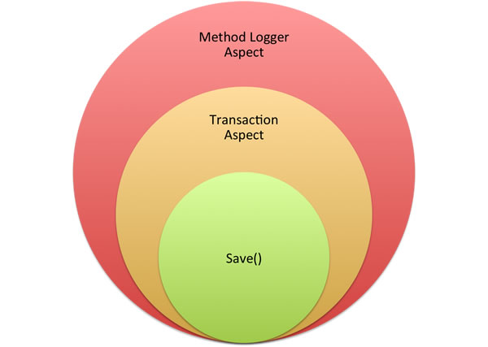

# Overview

> In computing, aspect-oriented programming \(AOP\) is a programming paradigm which aims to increase modularity by allowing the separation of cross-cutting concerns. AOP forms a basis for aspect-oriented software development.

I won't go into incredible software theory but pragmatic examples. What is the value of AOP? What does it solve? Well, how many times have we needed to do things like this:

```javascript
component name="UserService"{

    function save(){

      log.info("method save() called with arguments: #serializeJSON(arguments)#");

      transaction {
         // do some work here
      }

      log.info("Save completed successfully!");
    }
}
```

As you can see from the example above, my real business logic is in the `//do some work here` comment, but our code is littered with logging and transactions. What if I have 10 methods that are very familiarly the same? Do I repeat this same littered code \([cross-cutting concerns](http://en.wikipedia.org/wiki/Cross-cutting_concern)\)? The answer for most of us has always been _"YES! Of Course! How else do I do this?"_.

Well, you don't have to, AOP to the rescue. What AOP will let you do is abstract all that logging and transaction code to another object usually called an **Aspect**. Then we need to apply this aspect to something right? Well, in our case it has to apply to a target object, our `UserService`, and to a specific method, `save()`, which is usually refered to as the join point.

What does applying an aspect mean? It means that we will take that aspect you write and execute it at different points in time during the execution of the method you want to apply it to. This is usually refer to as an advice, **"Hey Buddy! Run it here!!!"**.

There are multiple types of AOP advices like before, around, after, etc. We have seen in ColdBox event handlers that you can do a `preHandler, postHandler and and aroundHandler` methods. These are AOP advices localized to event handlers that let you execute code before a handler event, after a handler event, or completely around the handler event. The most powerful form of advice is around, as it allows you to completely surround a method call with your own custom code. Does it ring a bell now? The transaction code for Pete's Sake! You need it to completely surround the method call! Voila! The around advice will allow you to completely take over the execution and you can even determine if you want to continue the execution or not.

So how does this magic happen? Well, our WireBox AOP engine will hijack your method \(join point\) and replace it with a new one, usually called an AOP proxy. This new method has all the plumbing already to allow you to apply as many aspects you like to that specific method. So as you can see from our diagram below, the save method is now decorated with our two aspects, but for all intent and purposes the outside world does not care about it, they just see the `save()` method.



