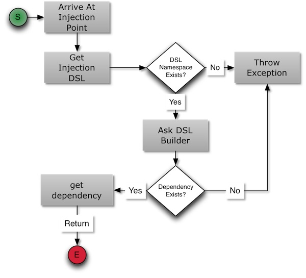

# How WireBox Resolves Dependencies

Most of the time we believe our DI engines should be black boxes, but we try to think otherwise. We encourage developers to know what is going on so they can debug easily and not hit their foreheads against their keyboards. Believe me, I have done so before. That is why WireBox is tightly integrated with [LogBox](http://logbox.ortusbooks.com) to provide incredible debugging information to ANY appender you desire so you can know what is going on. Another aspect of knowing what the DI engine does is how dependencies are resolved. Here is a typical flow of injection:

## Instance Creation

1. Object is requested by name and the Injector tries to check if the mapping exists for that name. If no mapping is found then it tries to locate the object by using the internal scan locations to try to find it. If it cannot find it and there is a parent injector defined, then the request is funneled to the parent injector and we start our process again. If no parent injector is declared and no localization, then we throw a not located exception.
2. If the object was found via the scan locations, then we register a new mapping according to its location and discover all the metadata out of the object in preparation for construction and DI
3. We now have a guaranteed mapping so we retrieve it and we verify if the mapping's metadata has been processed or not. If the mapping is marked with no autowiring then we skip to the next step. If not, we process the mapping's metadata and prepare it for DI
4. We verify that the scope define for the mapping exists, else we throw an invalid scope exception
5. We ask the scope to produce the mapping object for us. The scope is in charge of persistence, locking, etc.
6. The scope builds the instance by asking the injector to build a new instance with the correct constructor and constructor arguments and stores it in its scope once the injector builds it. The builder decides what type of construction is needed for the mapping as it can be a CFC, java object, webservice, RSS feed, factory method call, etc. Each constructor argument is processed for dependency resolution.
7. The scope then sends the instance for DI wiring and process back to the injector
8. The injector returns the instance

## Dependency Resolution

1. Arrive at the desired injection point and get the injection DSL. If the DSL is empty, then it defaults to the id/model namespace. For this injection DSL Namespace we try to find a valid DSL builder for it. If none is found an exception is thrown. If we have a match, then the DSL builder is called with the DSL string to retrieve.
2. The DSL builder then tries to parse and process the DSL string for object retrieval. If the DSL is a WireBox mapping then we try to retrieve the instance by name \(Refer back to Instance Creation\).
3. If the builder could not produce an instance, it is logged and DI is skipped on it.


**Caution** Circular dependencies are supported in all injection styles within WireBox. With one caveat, if you choose constructor arguments with circular dependencies, you must use object providers.


